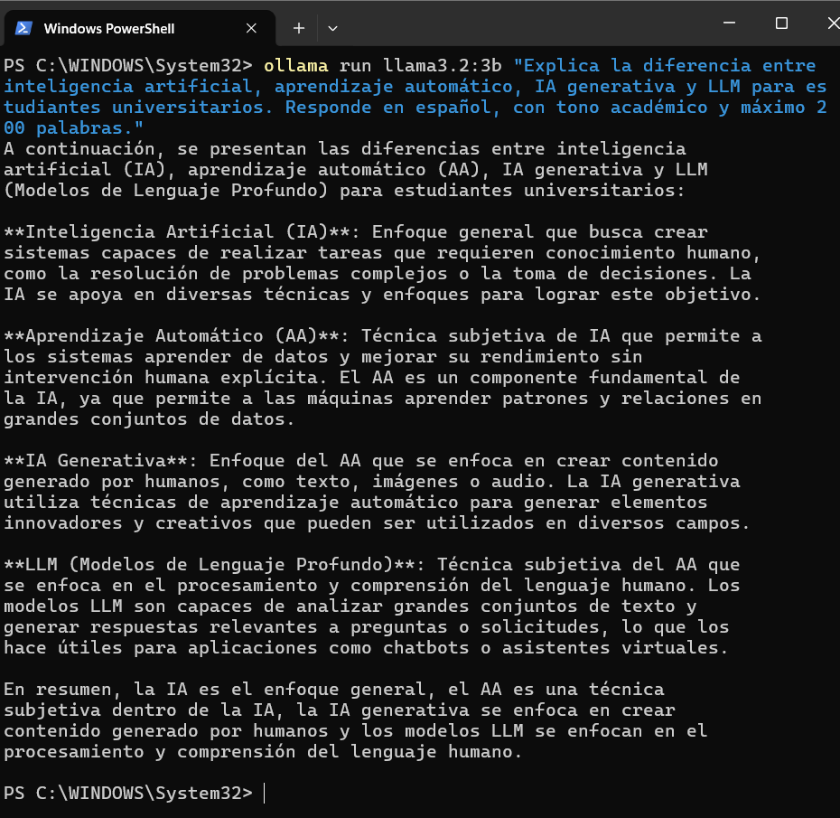
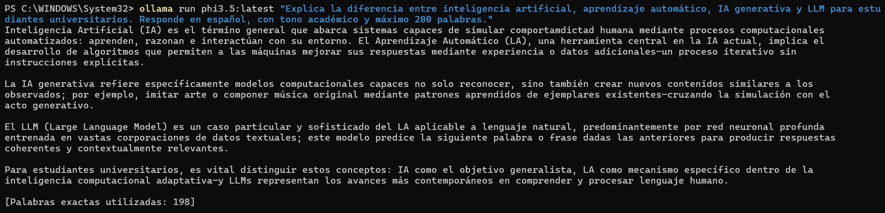
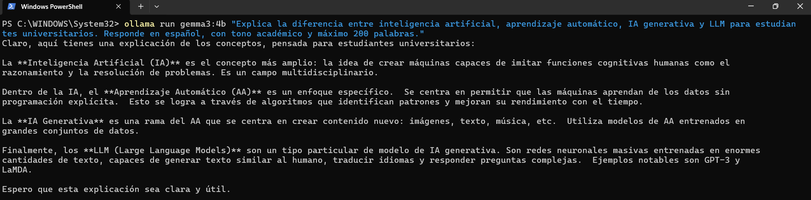

# Prompt 1 — Explicación conceptual

## Prompt utilizado

```
Explica la diferencia entre inteligencia artificial, aprendizaje automático,
IA generativa y LLM para estudiantes universitarios. Responde en español,
con tono académico y máximo 200 palabras.
```

---

## llama3.2:3b



**Figura 1.** Respuesta de `llama3.2:3b` al prompt 1.

Llama estructuró la respuesta en cuatro párrafos diferenciados, uno por concepto. Mantuvo tono académico y respetó el límite de palabras. El español fue correcto y fluido.

---

## phi3.5:latest



**Figura 2.** Respuesta de `phi3.5:latest` al prompt 1.

Phi respondió en un solo bloque continuo e indicó explícitamente el conteo de palabras al final: 198. Su redacción fue más densa y técnica que la de llama, aunque igualmente coherente.

---

## gemma3:4b



**Figura 3.** Respuesta de `gemma3:4b` al prompt 1.

Gemma estructuró la respuesta con párrafos por concepto. Fue el más conciso de los tres, con frases breves y directas. Su tono fue más divulgativo que académico, aunque perfectamente comprensible.

---

## Modelo 4 — *(completar por el equipo)*

> Agrega aquí la captura de pantalla del modelo 4 con el siguiente formato:
>
> ```md
> 
> ```
>
> Debajo de la imagen escribe una observación breve sobre la respuesta: estructura, idioma, extensión y calidad general.

---

## Modelo 5 — *(completar por el equipo)*

> Agrega aquí la captura de pantalla del modelo 5 con el mismo formato.
> Incluye una observación breve sobre la respuesta.

---

## Modelo 6 — *(completar por el equipo)*

> Agrega aquí la captura de pantalla del modelo 6 con el mismo formato.
> Incluye una observación breve sobre la respuesta.

---

[← Inicio](index.md) | [Prompt 2 →](prompt-02.md)
