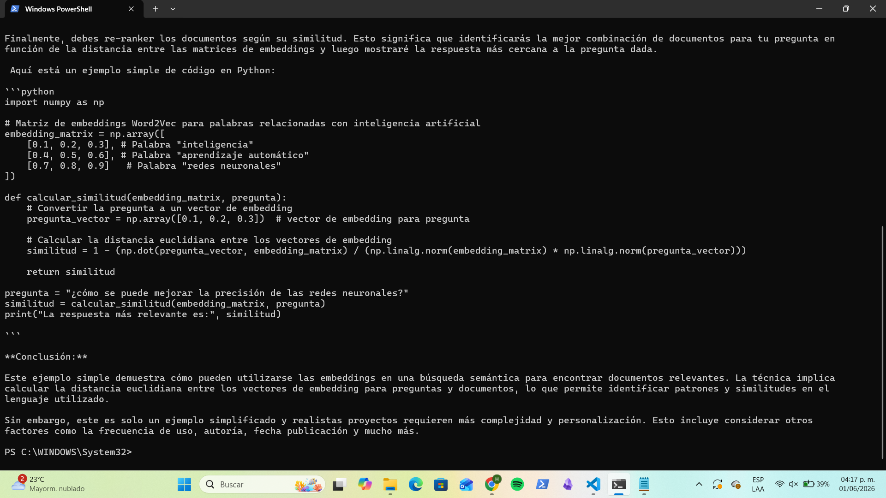
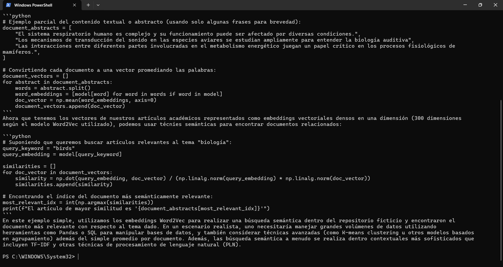
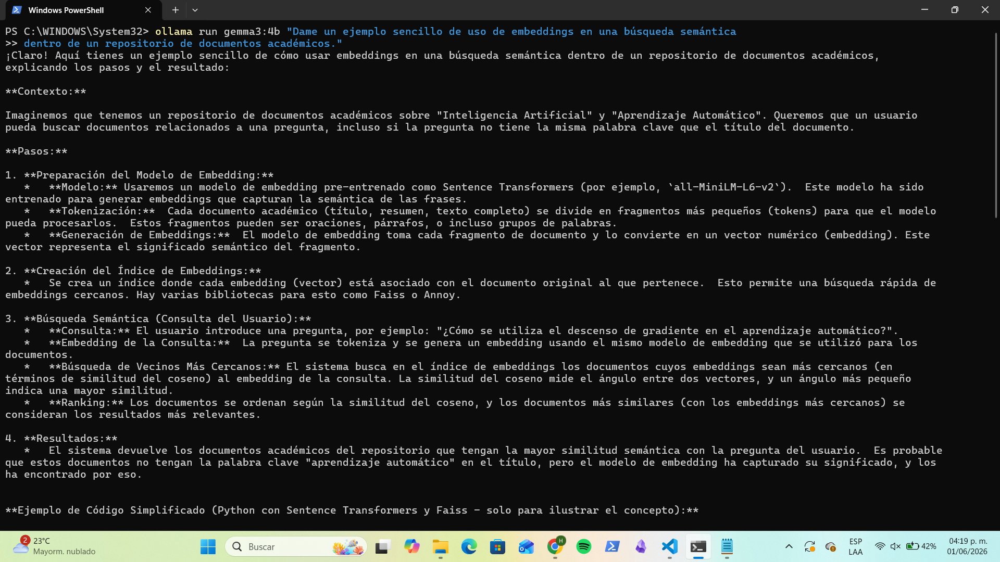

# Prompt 2 — Embeddings

## Prompt utilizado

```
Dame un ejemplo sencillo de uso de embeddings en una búsqueda semántica
dentro de un repositorio de documentos académicos.
```

---

## llama3.2:3b




**Figuras 4 y 5.** Respuesta de `llama3.2:3b` al prompt 2.

Llama respondió con cuatro pasos estructurados (preprocesamiento, creación de embeddings, similitud, re-ranking) y un ejemplo de código en Python usando NumPy. El enfoque fue pedagógico y orientado al proceso paso a paso.

---

## phi3.5:latest




**Figuras 6 y 7.** Respuesta de `phi3.5:latest` al prompt 2.

Phi ofreció un ejemplo más completo usando `gensim` y `Word2Vec`. Incluyó representación vectorial de documentos, cálculo de similitud coseno y recuperación del documento más relevante. Su código fue más detallado que el de llama.

---

## gemma3:4b




**Figuras 8, 9 y 10.** Respuesta de `gemma3:4b` al prompt 2.

Gemma fue el más detallado de los tres. Explicó el proceso en cuatro etapas e incluyó código usando `sentence-transformers` y `faiss`. Mencionó herramientas avanzadas como Faiss o Annoy para entornos reales y explicó el cálculo de similitud del coseno.

---

## Modelo 4 — *(completar por el equipo)*

> Agrega aquí la captura de pantalla del modelo 4 con el siguiente formato:
>
> ```md
> 
> ```
>
> Si la respuesta ocupó más de una pantalla, agrega tantas imágenes como sean necesarias con numeración consecutiva: `_p2.png`, `_p2b.png`, etc.
> Debajo escribe una observación breve sobre la respuesta.

---

## Modelo 5 — *(completar por el equipo)*

> Agrega aquí la captura de pantalla del modelo 5 con el mismo formato.
> Incluye una observación breve sobre la respuesta.

---

## Modelo 6 — *(completar por el equipo)*

> Agrega aquí la captura de pantalla del modelo 6 con el mismo formato.
> Incluye una observación breve sobre la respuesta.

---

[← Prompt 1](prompt-01.md) | [Prompt 3 →](prompt-03.md)
