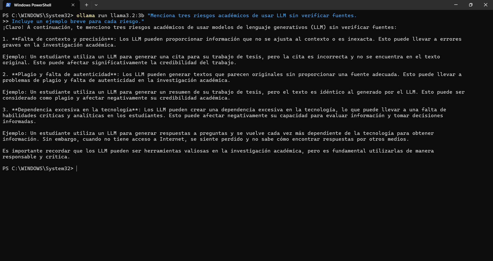
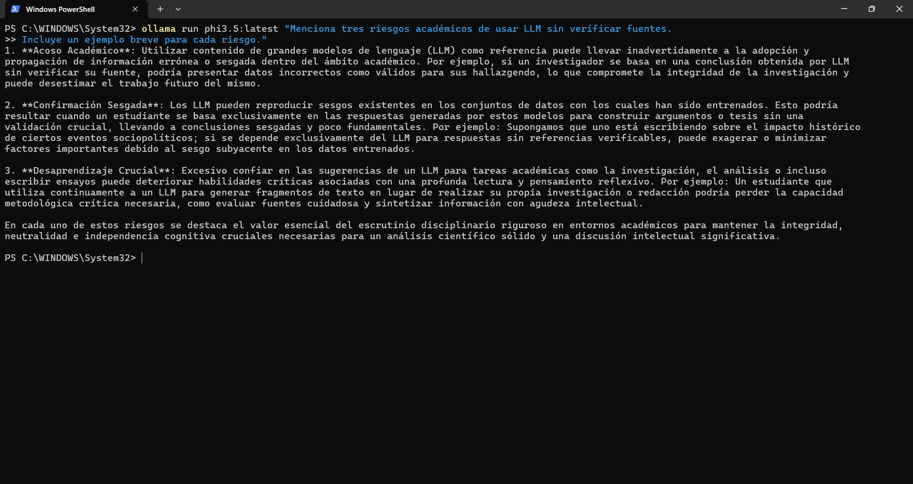
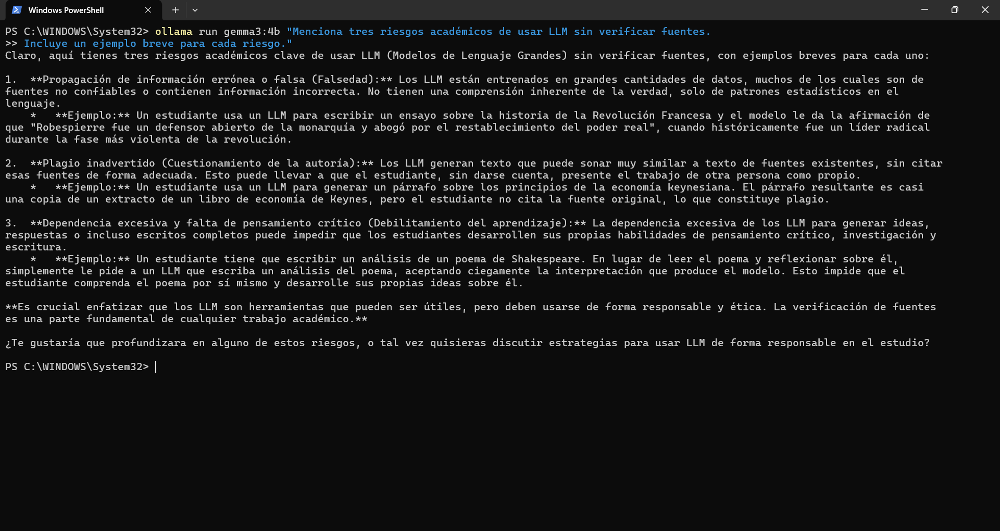

# Prompt 3 — Evaluación crítica

## Prompt utilizado

```
Menciona tres riesgos académicos de usar LLM sin verificar fuentes.
Incluye un ejemplo breve para cada riesgo.
```

---

## llama3.2:3b



**Figura 11.** Respuesta de `llama3.2:3b` al prompt 3.

Identificó: falta de contexto y precisión, plagio y falta de autenticidad, y dependencia excesiva en la tecnología. Cada riesgo incluyó un ejemplo concreto. La respuesta fue directa y bien delimitada.

---

## phi3.5:latest



**Figura 12.** Respuesta de `phi3.5:latest` al prompt 3.

Identificó: información errónea presentada como válida, confirmación sesgada, y pérdida de habilidades críticas. Sus ejemplos fueron más elaborados y fue el único que mencionó explícitamente el riesgo del sesgo en los datos de entrenamiento.

---

## gemma3:4b



**Figura 13.** Respuesta de `gemma3:4b` al prompt 3.

Identificó: propagación de información falsa (alucinaciones), plagio inadvertido, y dependencia excesiva con pérdida de pensamiento crítico. Sus ejemplos incluyeron casos históricos específicos. Al final ofreció continuar la conversación, mostrando un comportamiento más conversacional que los otros dos.

---

## Modelo 4 — *(completar por el equipo)*

> Agrega aquí la captura de pantalla del modelo 4 con el siguiente formato:
>
> ```md
> 
> ```
>
> Debajo escribe una observación breve sobre la respuesta: ¿qué riesgos identificó? ¿los ejemplos fueron concretos?

---

## Modelo 5 — *(completar por el equipo)*

> Agrega aquí la captura de pantalla del modelo 5 con el mismo formato.
> Incluye una observación breve sobre la respuesta.

---

## Modelo 6 — *(completar por el equipo)*

> Agrega aquí la captura de pantalla del modelo 6 con el mismo formato.
> Incluye una observación breve sobre la respuesta.

---

[← Prompt 2](prompt-02.md) | [Prompt 4 →](prompt-04.md)
