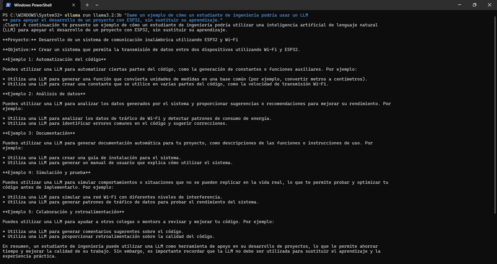
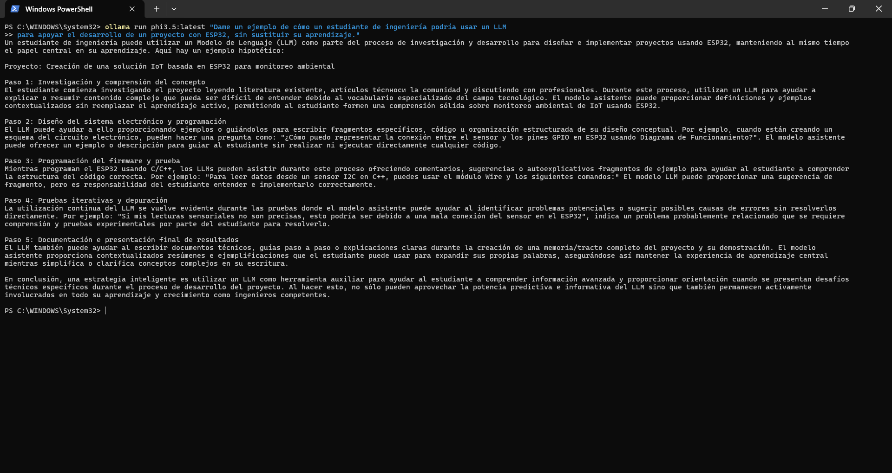
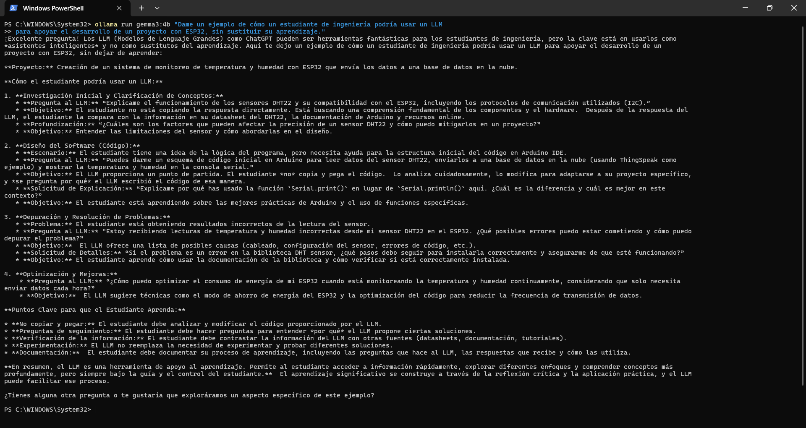

# Prompt 4 — Uso técnico

## Prompt utilizado

```
Dame un ejemplo de cómo un estudiante de ingeniería podría usar un LLM
para apoyar el desarrollo de un proyecto con ESP32, sin sustituir su aprendizaje.
```

---

## llama3.2:3b



**Figura 14.** Respuesta de `llama3.2:3b` al prompt 4.

Presentó cinco formas de uso: automatización de código, análisis de datos, documentación, simulación y colaboración. El enfoque fue en casos de uso abstractos sin desarrollar un escenario único.

---

## phi3.5:latest



**Figura 15.** Respuesta de `phi3.5:latest` al prompt 4.

Desarrolló un escenario completo de IoT con ESP32 para monitoreo ambiental, dividido en cinco fases del proyecto. Fue el más estructurado de los tres, con énfasis explícito en que el estudiante debe entender el código antes de usarlo.

---

## gemma3:4b



**Figura 16.** Respuesta de `gemma3:4b` al prompt 4.

También desarrolló un escenario completo de monitoreo con ESP32 y DHT22. Fue la respuesta más detallada: cuatro fases del proyecto con preguntas reales al LLM, objetivos de aprendizaje explícitos por cada interacción y principios para usar el LLM sin sustituir el aprendizaje.

---

## Modelo 4 — *(completar por el equipo)*

> Agrega aquí la captura de pantalla del modelo 4 con el siguiente formato:
>
> ```md
> 
> ```
>
> Debajo escribe una observación breve: ¿planteó un escenario concreto con ESP32? ¿fue útil y específico?

---

## Modelo 5 — *(completar por el equipo)*

> Agrega aquí la captura de pantalla del modelo 5 con el mismo formato.
> Incluye una observación breve sobre la respuesta.

---

## Modelo 6 — *(completar por el equipo)*

> Agrega aquí la captura de pantalla del modelo 6 con el mismo formato.
> Incluye una observación breve sobre la respuesta.

---

[← Prompt 3](prompt-03.md) | [Tabla comparativa →](tabla-comparativa.md)
