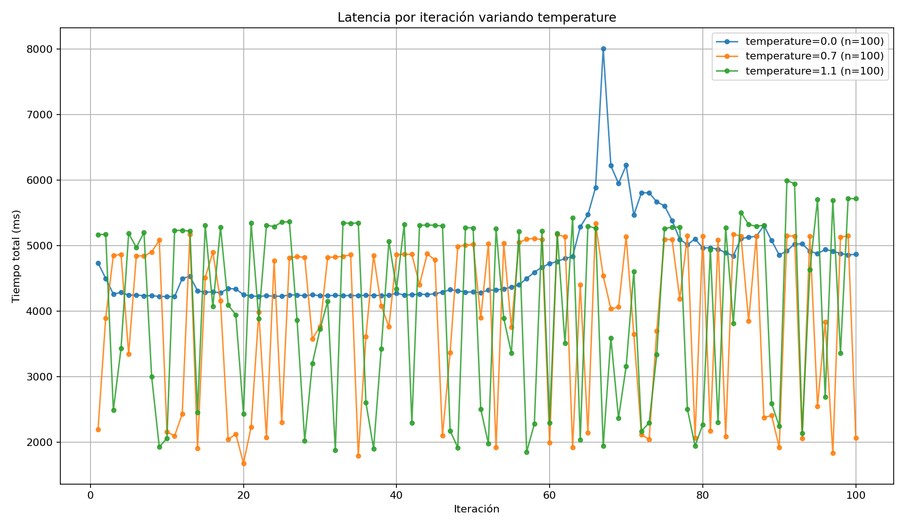
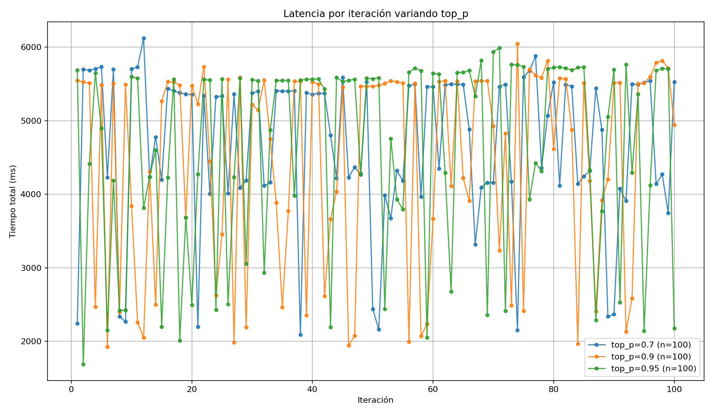
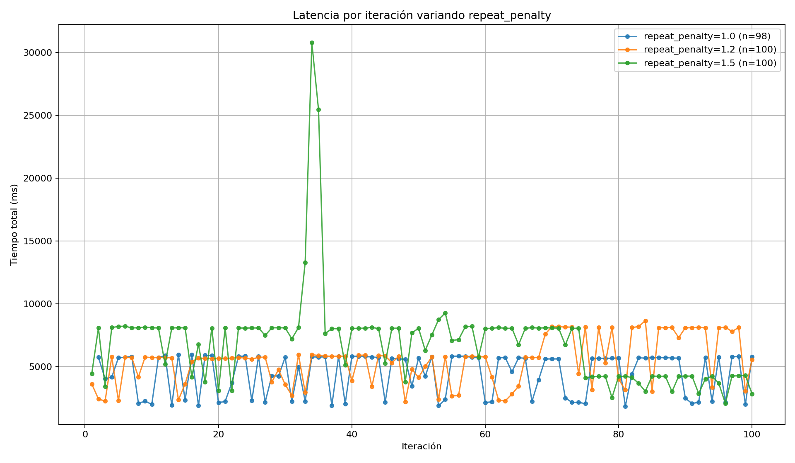

# Parte C — Variación de parámetros

## Configuración del experimento

Se utilizó un único modelo con un prompt fijo, variando tres parámetros con tres configuraciones cada uno. 100 ciclos por configuración.

**Modelo:** `phi3.5:latest`

**Prompt fijo:**
```
El usuario describió con voz: 'dibuja un perro sentado junto a una casa'.
Genera un JSON con exactamente estos campos: objects, layout, style, complexity.
Responde SOLO con el JSON, sin explicaciones, sin texto adicional, sin bloques de código.
```

**Parámetros variados:**

| Parámetro | Configuraciones | Qué controla |
|---|---|---|
| `temperature` | 0.0, 0.7, 1.1 | Aleatoriedad de la respuesta. 0 = determinista, >1 = más creativo |
| `top_p` | 0.7, 0.9, 0.95 | Vocabulario considerado. Valores altos = más diversidad |
| `repeat_penalty` | 1.0, 1.2, 1.5 | Penalización por repetir tokens. Valores altos = respuestas más largas |

---

## Resultados por parámetro

### Temperature

| Configuración | Tiempo promedio (s) | Tokens salida (media) | Tokens/s | Calidad promedio | Desv. std calidad |
|---|---|---|---|---|---|
| `temperature = 0.0` | 4.69 ± 0.61 | 160.0 ± 0.0 | 35.01 ± 3.79 | 4.0 / 10 | 0.0 |
| `temperature = 0.7` | 3.91 ± 1.26 | 124.91 ± 40.44 | 32.45 ± 1.10 | 5.74 / 10 | 2.74 |
| `temperature = 1.1` | 4.05 ± 1.39 | 120.98 ± 41.16 | 30.42 ± 1.05 | 5.72 / 10 | 2.75 |

### Top_p

| Configuración | Tiempo promedio (s) | Tokens salida (media) | Tokens/s | Calidad promedio | Desv. std calidad |
|---|---|---|---|---|---|
| `top_p = 0.7` | 4.68 ± 1.04 | 136.07 ± 30.05 | 29.49 ± 0.67 | 4.6 / 10 | 1.81 |
| `top_p = 0.9` | 4.47 ± 1.36 | 127.93 ± 39.25 | 29.07 ± 1.12 | 5.5 / 10 | 2.61 |
| `top_p = 0.95` | 4.61 ± 1.32 | 130.67 ± 37.08 | 28.80 ± 0.49 | 5.14 / 10 | 2.37 |

### Repeat_penalty

| Configuración | Tiempo promedio (s) | Tokens salida (media) | Tokens/s | Calidad promedio | Desv. std calidad |
|---|---|---|---|---|---|
| `repeat_penalty = 1.0` | 4.34 ± 1.74 | 120.95 ± 48.51 | 27.72 ± 4.00 | 5.86 / 10 | 2.79 |
| `repeat_penalty = 1.2` | 5.47 ± 1.85 | 133.85 ± 37.61 | 25.50 ± 3.84 | 5.8 / 10 | 2.76 |
| `repeat_penalty = 1.5` | 6.92 ± 3.72 | 144.84 ± 26.76 | 24.28 ± 8.59 | 3.79 / 10 | 0.86 |

---

## Gráficas

### Latencia variando temperature



**Figura 8.** `temperature=0.0` produce la curva más plana en latencia pero con un pico notable alrededor del ciclo 68. Esto ocurre porque al ser completamente determinista, cuando el modelo entra en un estado de repetición genera exactamente 160 tokens cada vez, y ocasionalmente hay una respuesta inusualmente larga. `temperature=0.7` y `1.1` muestran mayor variabilidad ciclo a ciclo porque la aleatoriedad hace que unas respuestas terminen antes que otras.

---

### Latencia variando top_p



**Figura 9.** Las tres configuraciones de `top_p` producen distribuciones de latencia casi indistinguibles. La diferencia entre 0.7, 0.9 y 0.95 es mínima en tiempo. Este parámetro afecta más la diversidad del vocabulario que la velocidad o la longitud.

---

### Latencia variando repeat_penalty



**Figura 10.** `repeat_penalty=1.5` genera el pico más extremo del experimento: ~30,800 ms en el ciclo 35. Esto ocurre porque una penalización alta obliga al modelo a buscar tokens cada vez más inusuales para evitar repetir, lo que puede generar respuestas largas e incoherentes antes de que el modelo encuentre un token de cierre. `repeat_penalty=1.0` (sin penalización) es el más estable.

---

## Respuestas a las preguntas guía

**1. ¿Qué configuración produjo respuestas más consistentes?**

`temperature=0.0` fue la más consistente en longitud: exactamente 160 tokens en todos los ciclos (desviación estándar de 0.0 en tokens de salida). Sin embargo, su calidad fue la más baja (4.0/10) porque al ser completamente determinista repite siempre la misma respuesta, que en este caso incluía texto fuera del JSON.

**2. ¿Qué configuración produjo mayor variabilidad?**

`repeat_penalty=1.5` fue la más variable, con una desviación estándar de 3.72 s en tiempo total y el pico de 30,800 ms. También fue la de mayor variabilidad en tokens/s (8.59). Este nivel de imprevisibilidad no es aceptable para un sistema en tiempo real.

**3. ¿Qué parámetro afectó más la longitud de la respuesta?**

`repeat_penalty` fue el parámetro que más afectó la longitud. A mayor penalización, mayor número de tokens de salida: 120.95 con 1.0, 133.85 con 1.2 y 144.84 con 1.5. El modelo genera respuestas más largas porque evita cerrar el JSON con tokens que ya usó.

**4. ¿Qué parámetro afectó más la calidad?**

`repeat_penalty` también afectó más la calidad, pero en sentido negativo a valores altos. Con 1.5 la calidad cayó a 3.79/10, la más baja del experimento. `temperature` afectó la calidad en el extremo 0.0 (4.0/10), pero los valores intermedios (0.7 y 1.1) mantuvieron calidad similar entre sí.

**5. ¿Qué configuración sería más adecuada para una aplicación de IA física?**

Para el proyecto del sketch con UR3 la configuración óptima es `temperature=0.7`, `top_p=0.9`, `repeat_penalty=1.1`. Es el punto de equilibrio entre velocidad (3.91 s), calidad aceptable (5.74/10) y variabilidad manejable. En un sistema físico la predictibilidad del tiempo de respuesta es más importante que maximizar la calidad en cada ciclo.

**6. ¿Qué configuración sería más adecuada para lluvia de ideas o generación creativa?**

`temperature=1.1` con `top_p=0.95` favorece la diversidad y creatividad. Produce respuestas más variadas ciclo a ciclo, lo que en un contexto creativo es deseable. No es útil para el proyecto de sketch porque necesita JSON estructurado, pero sería apropiado para explorar variaciones de conceptos o generar múltiples propuestas.
